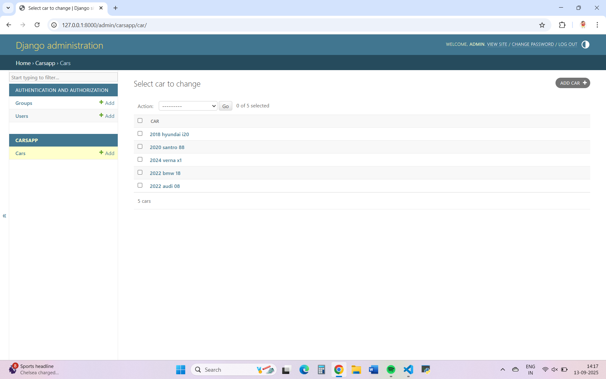

# Ex02 Django ORM Web Application
## Date: 16.09.2025

## AIM
To develop a Django application to store and retrieve data from a Car Inventory Database using Object Relational Mapping(ORM).

## DESIGN STEPS

### STEP 1:
Clone the problem from GitHub

### STEP 2:
Create a new app in Django project

### STEP 3:
Enter the code for admin.py and models.py

### STEP 4:
Execute Django admin and create details for 5 Car 

## PROGRAM
```
models.py
rom django.db import models

class Car(models.Model):
    make = models.CharField(max_length=100)
    model = models.CharField(max_length=100)
    year = models.PositiveIntegerField()
    price = models.DecimalField(max_digits=10, decimal_places=2)
    is_available = models.BooleanField(default=True)

    def __str__(self):
        return f"{self.year} {self.make} {self.model}"

## OUTPUT

admin.py
from django.contrib import admin
from .models import Car

admin.site.register(Car)
```

## OUTPUT



## RESULT
Thus the program for creating car inventory database database using ORM hass been executed successfully
